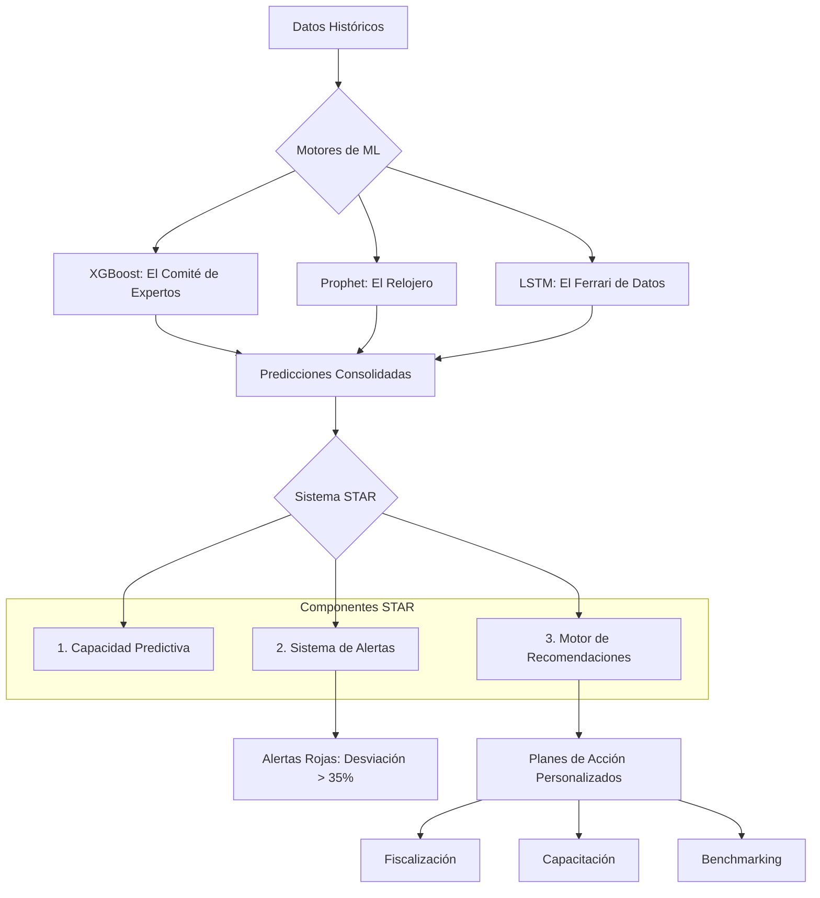

# Sistema de Alerta y Recomendación Territorial (STAR)

El sistema **STAR** no es solo un tablero de predicción; es una herramienta de gestión estratégica diseñada para cerrar la brecha entre los datos y la acción gubernamental.

## 🏗️ Arquitectura del Sistema

## 🛠️ Componentes Clave

### 1. Sistema de Alertas
Detecta automáticamente variaciones peligrosas entre el recaudo real y el pronosticado.
*   **Alerta Roja:** Desviación > 35%. Indica una posible crisis de flujo de caja para el sistema de salud local.
*   **Alerta Amarilla:** Tendencia a la baja sostenida por 3 meses.

### 2. Motor de Recomendaciones Personalizadas
A diferencia de los tableros tradicionales, STAR sugiere *qué hacer*. Las recomendaciones dependen de la clasificación del municipio:

| Clasificación | Escenario | Recomendación Sugerida |
| :--- | :--- | :--- |
| **Rezagado Crítico** | Bajo recaudo crónico | "Revisar procesos de fiscalización y control de contrabando." |
| **Volátil Estacional** | Grandes picos y valles | "Implementar fondos de reserva para meses de bajo recaudo (Ene-Feb)." |
| **Líder Estable** | Recaudo consistente | "Compartir mejores prácticas de gestión con municipios vecinos." |

## 🚀 Impacto Esperado
Pasar de una gestión de **crisis permanente** a una de **planificación preventiva**. El algoritmo predice la tormenta, pero el STAR señala el puerto seguro y sugiere los refuerzos necesarios para el barco de la salud regional.
